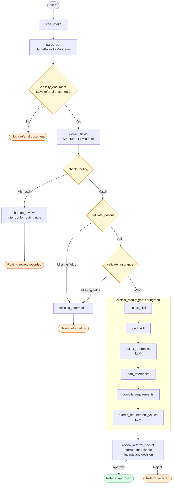

# Referral Intake Agent

LangGraph intake for a receiving practice: parse a PDF with LlamaParse, classify
referral intent, extract fields, validate routing and required data, and prepare
clinical findings for coordinator review. LLM calls use UF Navigator. The current
clinical catalog supports orthopedic knee referrals.

See the [project brief](healthcare_referral_ai_project_brief.md) for the project
outline, implemented scope, and future work.

## Workflow



See the [full workflow document](docs/referral-intake-agent-flow.md) for node behavior and state.

## Setup

```bash
python3 -m venv .venv
.venv/bin/python -m pip install -e '.[dev]'
```

Set the parser, model, and local Agent Server credentials in `.env`:

```dotenv
LLAMA_CLOUD_API_KEY=
NAVIGATOR_API_KEY=
NAVIGATOR_MODEL=
LANGSMITH_API_KEY=
```

The stream_agent, classification, and extraction share the Navigator model configuration.

## Run the app

Start Docker, then run from the repository root:

```bash
.venv/bin/langgraph up --wait --docker-compose compose.local.yml
```

The backend runs at `http://localhost:8123`; `--wait` returns when its containers
are healthy. Set this value in `frontend/.env.local`:

```dotenv
NEXT_PUBLIC_LANGGRAPH_API_URL=http://127.0.0.1:8123
```

Then start the UI:

```bash
cd frontend
npm install
npm run dev
```

Open `http://localhost:3000`. Chat and PDF uploads go through the `stream_agent`
agent. Each conversation supports one referral packet. Non-referral documents
end with “Not a referral document.” Referral reviews resume the same thread;
complete the pending review before sending another chat message.

## Sample knee referral PDFs

Use the PDFs in [knee_test_suite](knee_test_suite/) to try the intake workflow.
Attach one packet in the app to start a new referral case.

- [KNEE-100](knee_test_suite/KNEE-100.pdf)
- [KNEE-101](knee_test_suite/KNEE-101.pdf)
- [KNEE-102](knee_test_suite/KNEE-102.pdf)
- [KNEE-103](knee_test_suite/KNEE-103.pdf)
- [KNEE-104](knee_test_suite/KNEE-104.pdf)
- [KNEE-105](knee_test_suite/KNEE-105.pdf)
- [KNEE-106](knee_test_suite/KNEE-106.pdf)

## Restart, rebuild, and storage

Start existing stopped containers with Docker Desktop or:

```bash
docker start stream-langgraph-postgres-1 stream-langgraph-redis-1 stream-langgraph-api-1
```

After backend code or dependency changes, rerun the `langgraph up` command above,
including the Compose file. Restarting alone keeps the packaged code unchanged.

- PostgreSQL stores threads and checkpoints; keep its volume to retain them.
- Next.js saves PDFs in repo-local `data/uploads`. The Compose file mounts it
  read-only as `/uploads` in the backend; the UI translates paths for PDF viewing.
- Agent Server manages checkpointing. No database connection or checkpointer is
  required in graph code. PDF files are separate from database state.

## Backend-only development

```bash
.venv/bin/langgraph dev --no-browser
```

This runs on port `2024` and saves state in `.langgraph_api`. Submit a host-readable
PDF path through Studio or the SDK. The UI's `/uploads` paths require the Docker
mount and do not work unchanged with this mode.
