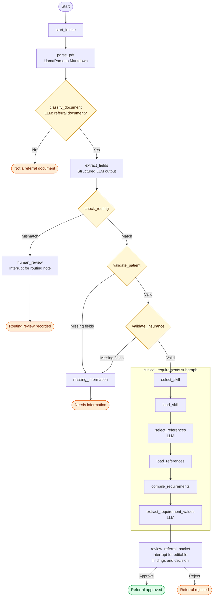

# Referral intake flow

[Setup and operation](../README.md) · [Standalone diagram](referral-intake-agent-flow.mmd)

## stream_agent

- `stream_agent` is the LangChain agent used by both frontend `useStream` hooks.
- It is created with LangChain's `create_agent`, using UF Navigator through the shared
  `ChatOpenAI` factory and its own [system prompt](../src/referral_intake/stream_agent.py).
- LangChain agents run on LangGraph internally. Agent Server registers the agent under
  `graphs` in `langgraph.json` to provide streaming, persistence, and review resumption.
- Its only tool, `referral_intake`, runs the existing intake graph for the attached PDF.
  The system prompt guides whether to reply or call it on each interaction;
  no middleware forces a tool call or hides the tool.
- The agent uses only LangChain's built-in `messages`, with no custom state schema.
  Upload details travel in the user message's `additional_kwargs.referral`;
  the tool reads them without asking the model to supply a file path.
- Text and upload notes are saved in `stream_agent` messages. Identity, capability,
  and recorded-status questions receive agent replies. Other operations are unavailable.
- One packet belongs to one conversation; completed intake is not run again for chat turns.
  `New chat` opens a fresh chat for another PDF; the original conversation
  remains available on its referral page.
- Intake streams its existing progress and review UI. Results are saved in the tool
  message's `artifact`, while its short text result goes to the model;
  pending interrupts carry the referral snapshot so detail pages survive reloads.
- AI Elements renders user and assistant messages, Markdown replies, and saved
  attachment cards. Internal metadata and tool messages stay out of the chat display.
- Uploads without a note display only the attachment card. They do not insert an
  intake request; the agent interprets the conversation using its role and tool description.
- A review-required result is saved as the tool artifact without interrupting the
  agent thread, so `Ask Stream` remains available while review is pending. Review
  controls submit the decision as another message in that same thread and resume
  the intake graph from the saved referral fields without parsing or extracting the
  PDF again. The same thread remains active for chat after review is complete.
- Chat-only conversations are excluded from the referral queues.
- Uploaded packets deferred by the user show as `Awaiting intake` in Processing.
- The original `referral_intake` registration keeps older checkpoints readable.
  Their next chat or review runs through `stream_agent` using the saved referral;
  review resumes without parsing or extracting the packet again.

## Intake graph

Nodes return typed `Command(update=..., goto=...)` for routing. The only static
edges are `START → start_intake` and
`clinical_requirements → review_referral_packet`. `destinations` describes routes
for diagram rendering; it does not execute them.

| Node | Action and next path |
|---|---|
| `start_intake` | Start packet progress → `parse_pdf`. |
| `parse_pdf` | Save LlamaParse Markdown → `classify_document`. |
| `classify_document` | LLM classification: referral → `extract_fields`; non-referral → `END`. |
| `extract_fields` | Save typed `ReferralExtraction` → `check_routing`. |
| `check_routing` | Matching specialty/subspecialty → `validate_patient`; otherwise → `human_review`. |
| `human_review` | Interrupt for a non-empty routing note; save `human_reviewed` → `END`. |
| `validate_patient` | Valid patient → `validate_insurance`; otherwise → `missing_information`. |
| `validate_insurance` | Valid insurance → `clinical_requirements`; otherwise → `missing_information`. |
| `missing_information` | Save `needs_information` and missing-field message → `END`. |
| `clinical_requirements` | Run the clinical subgraph; return draft findings → `review_referral_packet`. |
| `review_referral_packet` | Interrupt for edited findings, `decision`, and `reviewed_by`; save `referral_approved` or `referral_rejected` → `END`. |

## Classification

- The LLM returns `is_referral` and a short `reason` in `DocumentClassification`.
  See [classification instructions](../src/referral_intake/classification.py).
- Accept patient-specific referral intent, regardless of specialty or missing details.
- Reject standalone records, blank forms, and unrelated documents without referral intent.
- Rejection sets `not_referral_document`, skips extraction and review, and displays
  “Not a referral document. Please upload a patient referral packet.”
- Packet progress stays active through parsing and classification.
- Empty Markdown, model failures, and invalid output are run errors.

## Clinical subgraph

- Supports `orthopedics/knee`: ACL, meniscus, and osteoarthritis; general consultation
  and surgical evaluation.
- Skill selection, file loading, and requirement compilation are deterministic.
- The LLM selects reference IDs and extracts findings from Markdown.
- Requirements include IDs, display descriptions, optional `guidance`, required flags,
  and sources. Findings include the requirement ID, documentation status, and value.
- Coordinators review clinical gaps. Missing required patient or insurance data stops
  the workflow before clinical extraction.
- Automatic clinical follow-up, scheduling, and other specialties are not implemented.

## State and UI

- `stream_agent` input: `messages`. Uploaded PDF details are message metadata;
  the visible message text also tells the model that a PDF was attached.
- Intake tool input: `pdf_path`, optional `pdf_name`; one packet per conversation.
- Results: Markdown, classification, extracted fields, validated patient and insurance
  data, and clinical findings.
- Status: `outcome`, `message`, `missing_fields`, and `review_text` as applicable.
- Clinical review pauses with an interrupt; an outcome may not yet exist.
- `workflow` tracks progress; `ui` holds progress, review, and completion messages.
  Non-referrals display “Not a referral” in the list.
- `GraphDependencies` keeps service clients and routing policy outside saved state.
  Subgraph input/output schemas keep internal instructions and working fields private.
- See the [README](../README.md#restart-rebuild-and-storage) for persistence and PDF storage.
