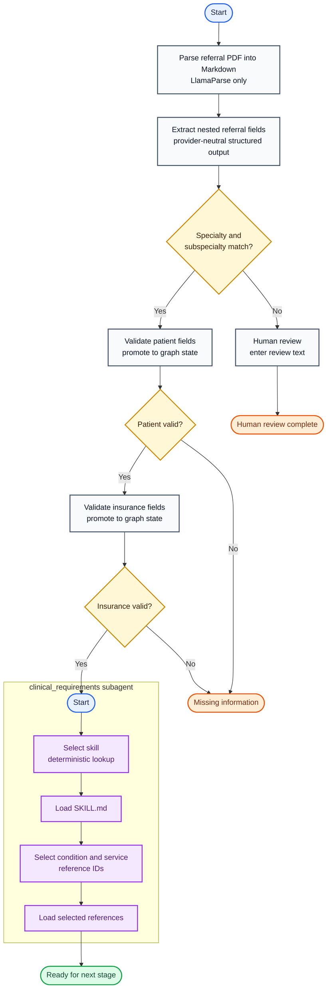

# Referral Intake Agent Flow

Baseline version: `v0.8`

Updated: 2026-08-20

Status: initial skill and reference-loading flow implemented

The compiled `clinical_requirements` graph is one node in the parent referral
graph after insurance validation. Its current executable scope selects one
catalogued skill, loads its instructions, selects supported logical references,
and loads their content.



## Current executable node contract

| Graph node | Responsibility | Next path |
|---|---|---|
| `parse_pdf` | Parse the PDF into Markdown using LlamaParse only | `Command(goto="extract_fields")` |
| `extract_fields` | Store provider-neutral `ReferralExtraction` under `state.extracted` | `Command(goto="check_routing")` |
| `check_routing` | Check specialty and subspecialty against in-code policy | Command to patient validation or human review |
| `human_review` | Pause with `interrupt()` and store non-empty reviewer text on resume | `Command(goto=END)` |
| `validate_patient` | Validate required patient fields and promote `state.patient` | Command to insurance validation or missing information |
| `validate_insurance` | Validate required insurance fields and promote `state.insurance` | Command to `clinical_requirements` or missing information |
| `clinical_requirements` | Run the compiled shared-state skill-selection subgraph | Ready for next stage |
| `missing_information` | Finalize the missing-field message | `Command(goto=END)` |

## Clinical requirements subagent

The parent graph treats the compiled `clinical_requirements` graph as one
node. Internally, its initial linear flow is:

| Subagent node | Initial responsibility | Next path |
|---|---|---|
| `select_skill` | Deterministically map normalized specialty and subspecialty to a typed skill ID | `Command(goto="load_skill")` |
| `load_skill` | Deterministically load the selected skill's complete `SKILL.md` | `Command(goto="select_references")` |
| `select_references` | Read `SKILL.md` and return one supported condition ID and one supported service ID | `Command(goto="load_references")` |
| `load_references` | Deterministically load both selected files, keyed by logical reference ID | `Command(goto=END)` |

The initial catalog contains only `orthopedics/knee`. All files are placeholders
and intentionally contain no uncurated clinical rules.

```text
skills/
├── orthopedics/
│   └── knee/
│       ├── SKILL.md
│       └── references/
│           ├── conditions/
│           │   ├── osteoarthritis.md
│           │   ├── acl-tear.md
│           │   └── meniscus-tear.md
│           └── services/
│               ├── surgical-evaluation.md
│               └── general-consult.md
└── cardiology/                       # empty placeholder
```

The decision diamonds are not separate Python nodes. Each node returns a typed
`Command` containing both its state update and `goto` destination. Each graph
builder declares only its required `START` edge and no explicit conditional
edges.

## State boundary

```text
ReferralState
├── pdf_path
├── markdown
├── extracted: ReferralExtraction
│   ├── patient: ExtractedPatient
│   │   └── sex
│   ├── insurance: ExtractedInsurance
│   ├── provider: Provider
│   ├── referring_provider: Provider
│   ├── specialty
│   ├── subspecialty
│   ├── service
│   ├── condition
│   ├── priority
│   ├── reason_for_referral
│   └── referral_type: ReferralType
├── patient: Patient                 # includes required validated sex
├── insurance: Insurance             # present only after validation
├── reason_for_referral              # promoted during extraction
├── selected_skill: ClinicalSkillName
├── skill_instructions               # complete SKILL.md
├── selected_references: ReferenceSelection
│   ├── condition                    # logical ID only
│   └── service                      # logical ID only
├── reference_contents               # keyed by logical reference IDs
├── missing_fields
├── outcome
├── message
└── review_text                     # present after human review
```

Service clients and routing configuration are passed through LangGraph runtime
context and are not part of referral state. PostgreSQL checkpoints persist each
run under the configured `thread_id` so an interrupt can resume safely.

## Deferred work

- Curate the knee clinical skill and reference content.
- Add shoulder and spine skill directories when their content is ready.
- Add `generate_plan` and `execute_plan` nodes after the skill format is stable.
- Define plan state, execution outputs, and failure paths.
- Add later treatment-plan or clinical-evidence nodes.
- Replace the initial in-code routing policy with receiving-practice data.
