# Referral Intake Agent Flow

Baseline version: `v1.4`

Updated: 2026-09-03

Status: clinical findings require human approval or rejection

The compiled `clinical_requirements` graph is one node in the parent referral
graph after insurance validation. It returns a typed draft containing the
selected skill, references, requirements, and findings. The parent then pauses
at `review_referral_packet` so the root UI stream can present editable findings.

```mermaid
flowchart TD
    START([Start])
    INIT_PROGRESS[Start coordinator workflow]
    PARSE[Parse referral PDF into Markdown<br/>LlamaParse only]
    EXTRACT[Extract nested referral fields<br/>provider-neutral structured output]
    ROUTING{"Specialty and<br/>subspecialty match?"}
    PATIENT[Validate patient fields<br/>promote to graph state]
    PATIENT_VALID{"Patient valid?"}
    INSURANCE[Validate insurance fields<br/>promote to graph state]
    INSURANCE_VALID{"Insurance valid?"}

    subgraph CLINICAL_REQUIREMENTS["clinical_requirements subagent"]
        direction TB
        CR_START([Start])
        SELECT_SKILL[Select skill<br/>deterministic lookup]
        LOAD_SKILL[Load SKILL.md]
        SELECT_REFERENCES[Select condition and service<br/>reference IDs]
        LOAD_REFERENCES[Load selected references]
        COMPILE_REQUIREMENTS[Compile requirements<br/>deterministic]
        EXTRACT_REQUIREMENTS[Extract requirement values<br/>structured LLM output]

        CR_START --> SELECT_SKILL
        SELECT_SKILL --> LOAD_SKILL
        LOAD_SKILL --> SELECT_REFERENCES
        SELECT_REFERENCES --> LOAD_REFERENCES
        LOAD_REFERENCES --> COMPILE_REQUIREMENTS
        COMPILE_REQUIREMENTS --> EXTRACT_REQUIREMENTS
    end

    REVIEW_PACKET[Editable clinical review<br/>approve or reject packet]
    HUMAN_REVIEW[Human review<br/>enter review text]
    REVIEWED([Human review complete])
    MISSING_INFO([Missing information])
    APPROVED([Referral approved])
    REJECTED([Referral rejected])

    START --> INIT_PROGRESS
    INIT_PROGRESS --> PARSE
    PARSE --> EXTRACT
    EXTRACT --> ROUTING
    ROUTING -->|Yes| PATIENT
    ROUTING -->|No| HUMAN_REVIEW
    HUMAN_REVIEW --> REVIEWED
    PATIENT --> PATIENT_VALID
    PATIENT_VALID -->|Yes| INSURANCE
    PATIENT_VALID -->|No| MISSING_INFO
    INSURANCE --> INSURANCE_VALID
    INSURANCE_VALID -->|Yes| CR_START
    INSURANCE_VALID -->|No| MISSING_INFO
    EXTRACT_REQUIREMENTS --> REVIEW_PACKET
    REVIEW_PACKET -->|Approve| APPROVED
    REVIEW_PACKET -->|Reject| REJECTED

    classDef input fill:#e8f1ff,stroke:#2563eb,color:#172554,stroke-width:2px;
    classDef process fill:#f8fafc,stroke:#475569,color:#0f172a,stroke-width:2px;
    classDef decision fill:#fff7d6,stroke:#ca8a04,color:#422006,stroke-width:2px;
    classDef success fill:#dcfce7,stroke:#16a34a,color:#14532d,stroke-width:2px;
    classDef attention fill:#ffedd5,stroke:#ea580c,color:#7c2d12,stroke-width:2px;
    classDef failure fill:#fee2e2,stroke:#dc2626,color:#7f1d1d,stroke-width:2px;
    classDef subagent fill:#f3e8ff,stroke:#9333ea,color:#581c87,stroke-width:2px;

    class START,CR_START input;
    class INIT_PROGRESS,PARSE,EXTRACT,PATIENT,INSURANCE,HUMAN_REVIEW,REVIEW_PACKET process;
    class SELECT_SKILL,LOAD_SKILL,SELECT_REFERENCES,LOAD_REFERENCES,COMPILE_REQUIREMENTS,EXTRACT_REQUIREMENTS subagent;
    class ROUTING,PATIENT_VALID,INSURANCE_VALID decision;
    class APPROVED success;
    class MISSING_INFO,REVIEWED,REJECTED attention;
```



## Current executable node contract

| Graph node | Responsibility | Next path |
|---|---|---|
| `start_intake` | Initialize coordinator-facing workflow progress | `Command(goto="parse_pdf")` |
| `parse_pdf` | Parse the PDF into Markdown using LlamaParse only | `Command(goto="extract_fields")` |
| `extract_fields` | Store provider-neutral `ReferralExtraction` under `state.extracted` | `Command(goto="check_routing")` |
| `check_routing` | Check specialty and subspecialty against in-code policy | Command to patient validation or human review |
| `human_review` | Pause with `interrupt()` and store non-empty reviewer text on resume | `Command(goto=END)` |
| `validate_patient` | Validate required patient fields and promote `state.patient` | Command to insurance validation or missing information |
| `validate_insurance` | Validate required insurance fields and promote `state.insurance` | Command to `clinical_requirements` or missing information |
| `clinical_requirements` | Run the clinical subgraph and return draft requirements and findings | `review_referral_packet` |
| `review_referral_packet` | Pause for editable findings and an approve/reject decision | `Command(goto=END)` |
| `missing_information` | Finalize the missing-field message | `Command(goto=END)` |

## Clinical requirements subagent

The parent graph treats the compiled `clinical_requirements` graph as one
node. Internally, its initial linear flow is:

| Subagent node | Initial responsibility | Next path |
|---|---|---|
| `select_skill` | Deterministically map normalized specialty and subspecialty to a typed skill ID | `Command(goto="load_skill")` |
| `load_skill` | Deterministically load the selected skill's complete `SKILL.md` | `Command(goto="select_references")` |
| `select_references` | Read `SKILL.md` and return one supported condition ID and one supported service ID | `Command(goto="load_references")` |
| `load_references` | Deterministically load both selected files, keyed by logical reference ID | `Command(goto="compile_requirements")` |
| `compile_requirements` | Deterministically merge the requirement definitions in `SKILL.md` and the selected references | `Command(goto="extract_requirement_values")` |
| `extract_requirement_values` | Extract one finding per compiled requirement and return the draft clinical result | `Command(goto=END)` |

The initial catalog contains only `orthopedics/knee`. Each Markdown file keeps
human-readable instructions and a YAML requirement-definition block with stable
IDs. The compiler reads those blocks without an LLM, preserves their source
logical IDs, rejects duplicates, and produces one ordered requirement list.

```text
skills/
├── orthopedics/
│   └── knee/
│       ├── SKILL.md
│       └── references/
│           ├── conditions/
│           │   ├── osteoarthritis.md
│           │   ├── acl-tear.md
│           │   └── meniscus-tear.md
│           └── services/
│               ├── surgical-evaluation.md
│               └── general-consult.md
└── cardiology/                       # empty placeholder
```

The decision diamonds are not separate Python nodes. Each node returns a typed
`Command` containing both its state update and `goto` destination. Each graph
builder declares only its required `START` edge and no explicit conditional
edges.

## State boundary

```text
ReferralState
├── pdf_path
├── markdown
├── extracted: ReferralExtraction
│   ├── patient: ExtractedPatient
│   │   └── sex
│   ├── insurance: ExtractedInsurance
│   ├── provider: Provider
│   ├── referring_provider: Provider
│   ├── specialty
│   ├── subspecialty
│   ├── service
│   ├── condition
│   ├── priority
│   ├── reason_for_referral
│   └── referral_type: ReferralType
├── patient: Patient                 # includes required validated sex
├── insurance: Insurance             # present only after validation
├── workflow                         # coordinator-facing UI stages keyed by ID
│   └── {stage_id}
│       ├── title
│       ├── description
│       ├── status                   # active, complete, or attention
│       └── order
├── ui                               # registry-driven LangGraph UI messages
├── clinical_requirements: ClinicalRequirementsResult
│   ├── skill: ClinicalSkillName
│   ├── references: ReferenceSelection
│   │   ├── condition                # logical ID only
│   │   └── service                  # logical ID only
│   ├── requirements: list[RequirementDefinition]
│   │   ├── id
│   │   ├── description
│   │   ├── required
│   │   └── source                   # logical ID, never a file path
│   ├── findings: list[RequirementFinding]
│       ├── requirement_id
│       ├── status                   # documented or not_documented
│       └── value
│   └── decision                     # approve or reject
├── missing_fields
├── outcome
├── message
└── review_text                     # present after human review
```

```text
ClinicalRequirementsState extends ReferralState
│                                     # parent keys are inherited, not redeclared
├── selected_skill                    # private subgraph working field
├── skill_instructions
├── selected_references
├── reference_contents
├── compiled_requirements
├── extracted_findings
└── inherited clinical_requirements   # shared parent output
```

Because the compiled subgraph is registered directly as the parent graph's
`clinical_requirements` node, LangGraph passes matching parent channels into it.
The subgraph nodes use `ClinicalRequirementsState`, which inherits
`ReferralState` and adds only private working fields. The shared parent keys are
therefore defined once, and private fields are filtered out when the subgraph
returns. No separate state object is manually passed between the graphs.

`reason_for_referral` is read directly from `state.extracted`. Nodes write
`outcome` and `message` only for meaningful terminal, missing-information, or
human-review results; routine processing transitions are represented by
`Command(goto=...)` alone.

Coordinator progress is independent of internal node names. Meaningful nodes
merge entries into `state.workflow` and emit named messages into `state.ui`.
The frontend maps `referral_progress`, `clinical_review`, `routing_review`, and
`referral_completion` through a component registry. The clinical subgraph
returns before the parent interrupt, so editable review UI is present in the
root `useStream.values.ui` state when the run pauses.

The requirement extraction LLM receives only the compiled definitions and full
referral Markdown. It returns structured findings and is instructed to avoid
inference. A human sees those findings, then explicitly approves or rejects the
packet. Deterministic finding validation is deferred for now.

Service clients and routing configuration are passed through LangGraph runtime
context and are not part of referral state. PostgreSQL checkpoints persist each
run under the configured `thread_id` so an interrupt can resume safely.

## Deferred work

- Define downstream handling for approved and rejected referrals.
- Add deterministic validation of generated findings when its policy is defined.
- Add shoulder and spine skill directories when their content is ready.
- Add `generate_plan` and `execute_plan` nodes after the skill format is stable.
- Define plan state, execution outputs, and failure paths.
- Add later treatment-plan or clinical-evidence nodes.
- Replace the initial in-code routing policy with receiving-practice data.
