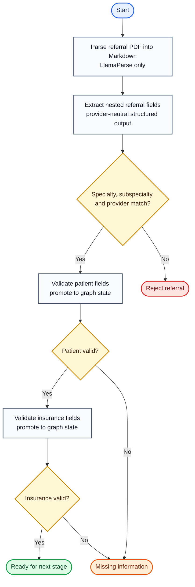

# Referral Intake Agent Flow

Baseline version: `v0.3`  
Updated: 2026-08-15

This diagram tracks the executable LangGraph workflow. Future workflow changes
should update this file and the corresponding code in the same change.



## Executable node contract

| Graph node | Responsibility | Next path |
|---|---|---|
| `parse_pdf` | Parse the PDF into Markdown using LlamaParse only | `Command(goto="extract_fields")` |
| `extract_fields` | Store provider-neutral `ReferralExtraction` under `state.extracted` | `Command(goto="check_routing")` |
| `check_routing` | Check specialty and subspecialty against in-code policy | Command to patient validation or rejection |
| `reject_referral` | Finalize the simple rejection message | `Command(goto=END)` |
| `validate_patient` | Validate required patient fields and promote `state.patient` | Command to insurance validation or missing information |
| `validate_insurance` | Validate required insurance fields and promote `state.insurance` | Command to `END` or missing information |
| `missing_information` | Finalize the missing-field message | `Command(goto=END)` |

The decision diamonds are not separate Python nodes. Each node returns a typed
`Command` containing both its state update and `goto` destination. The graph
builder has one explicit edge—`START` to `parse_pdf`—and no explicit
conditional edges.

## State boundary

```text
ReferralState
├── pdf_path
├── markdown
├── extracted: ReferralExtraction
│   ├── patient: ExtractedPatient
│   ├── insurance: ExtractedInsurance
│   ├── provider: Provider
│   ├── referring_provider: Provider
│   ├── specialty
│   ├── subspecialty
│   └── service
├── patient: Patient                 # present only after validation
├── insurance: Insurance             # present only after validation
├── missing_fields
├── outcome
└── message
```

Service clients and routing configuration are passed through LangGraph runtime
context and are not part of referral state.

## Deferred work

- Select and implement the structured-output LLM provider.
- Add treatment-plan or clinical-evidence nodes.
- Add persistence and human review.
- Replace the initial in-code routing policy with receiving-practice data.
